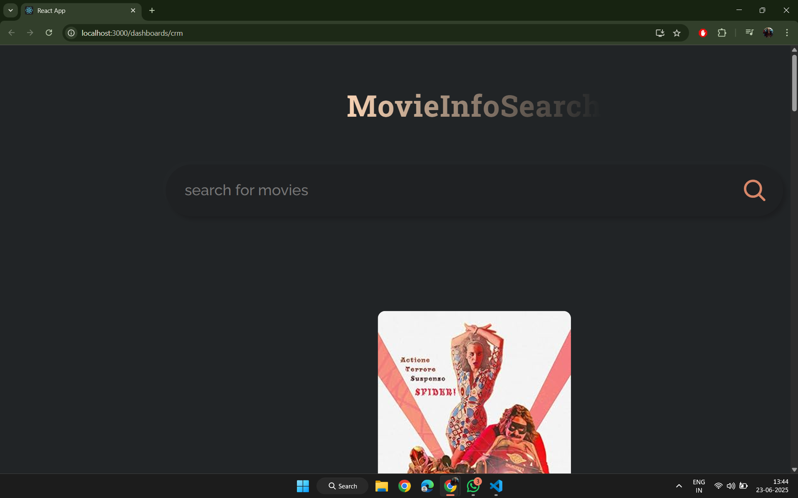
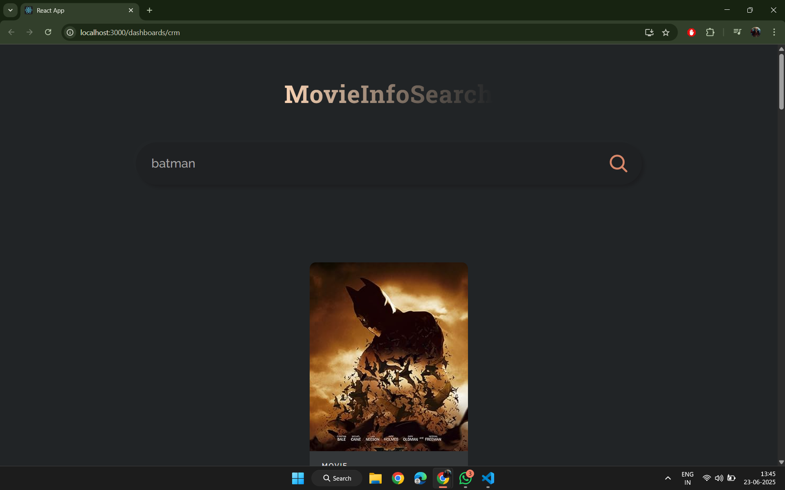
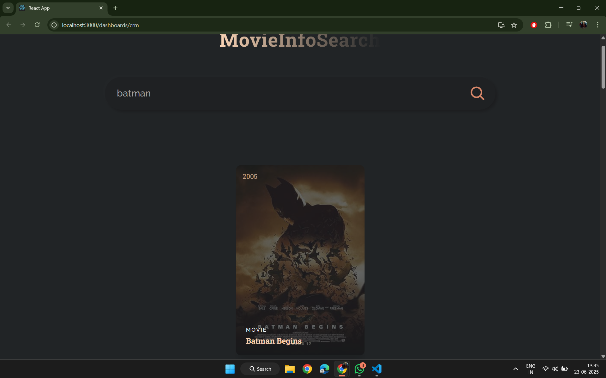

# 🎬 React Movie Search App

This is a simple and clean **React.js movie search application** where users can search for movies and view their posters, types, years, and titles. On **mouse hover**, additional details are revealed for a better browsing experience.

---

## ✨ Features

- 🔍 **Movie Search** using the OMDb API
- 🖼️ Fallback image when no poster is available
- 🧠 Displays **movie title, year, type**
- 🖱️ On **mouse hover**, extra info is shown
- ⚡ Built with React functional components and hooks

---

## 📸 Screenshots

### 🏠 Homepage
Displays a clean and minimal layout before searching.



---

### 🔍 Search Result
Displays movies matching the search query.



---

### 🖱️ Mouse Hover Effect
Hovering over a movie reveals additional information (e.g., type or release year).




---

## 🛠️ Technologies Used

- **React.js**
- **JavaScript (ES6+)**
- **CSS**
- **OMDb API** for movie data

---

## 🚀 Getting Started

### 📦 Install dependencies

```bash
npm install

